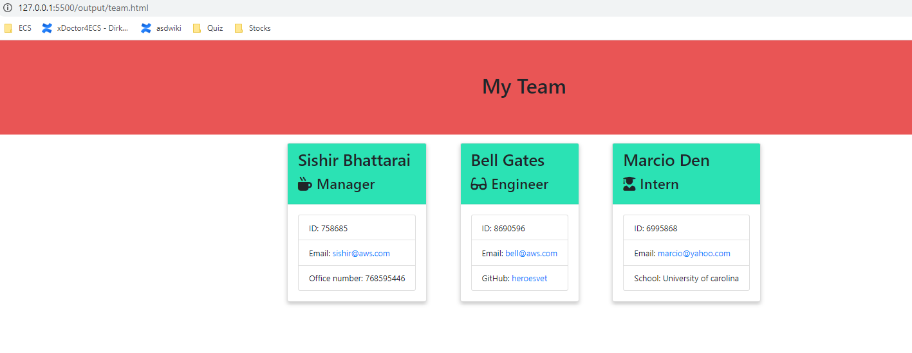

## User Story:
* As a manager
I want to generate a webpage that displays my team's basic info
so that I have quick access to emails and GitHub profiles

* The project must prompt the user to build an engineering team. An engineering
team consists of a manager, and any number of engineers and interns.

* The project must generate a `team.html` page in the `output` directory, that displays a nicely formatted team roster. Each team member should display the following in no particular order:

  * Name

  * Role

  * ID

  * Role-specific property (School, link to GitHub profile, or office number)

## Github link:

https://github.com/sishirbhattarai/team-portfolio-page

## Technology Used:
HTML, CSS, JS, npm, node

## Test and Results:
* The application will prompt the user for information about the team manager and then information about the team members. The user can input any number of team members, and they may be a mix of engineers and interns. This assignment must also pass all unit tests. When the user has completed building the team, the application will create an HTML file that displays a nicely formatted team roster based on the information provided by the user. Following the [common templates for user stories](https://en.wikipedia.org/wiki/User_story#Common_templates), we can frame this challenge as follows:

* Ran the test and it passed all tests. 

## Video Link:
https://drive.google.com/file/d/1Ax03bZBpFK7RWJTXnL6IHaRpD5iJq5LE/view

- - -
© 2019 Trilogy Education Services, a 2U, Inc. brand. All Rights Reserved.
